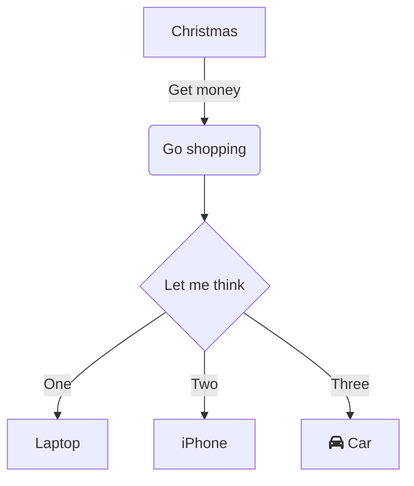

BLA BLA BLA

&nbsp;

<SwmToken path="/src/App.jsx" pos="3:2:2" line-data="function App() {">`App`</SwmToken>

<SwmSnippet path="/src/index.jsx" line="7">

---

Here we create a root element with <SwmToken path="/src/index.jsx" pos="7:6:8" line-data="const root = ReactDOM.createRoot(document.getElementById(&#39;root&#39;));">`ReactDOM.createRoot`</SwmToken> and render the <SwmToken path="/src/index.jsx" pos="10:2:2" line-data="    &lt;App /&gt;">`App`</SwmToken> component inside <SwmToken path="/src/index.jsx" pos="9:2:4" line-data="  &lt;React.StrictMode&gt;">`React.StrictMode`</SwmToken>.

```javascript
const root = ReactDOM.createRoot(document.getElementById('root'));
root.render(
  <React.StrictMode>
    <App />
  </React.StrictMode>
);
```

---

</SwmSnippet>

&nbsp;

<SwmSnippet path="/src/index.jsx" line="14">

---

&nbsp;

```javascript
// If you want to start measuring performance in your app, pass a function
// to log results (for example: reportWebVitals(console.log))
// or send to an analytics endpoint. Learn more: https://bit.ly/CRA-vitals
reportWebVitals(); //hello
```

---

</SwmSnippet>

&nbsp;

<SwmSnippet path="src/App.jsx" line="3">

---

&nbsp;

```
function App() {
  return (
    <div className="App">
      <header className="App-header">
        
        <p>
          GitHub Codespaces <span className="heart">♥️</span> React
        </p>
        <p className="small">
```

---

</SwmSnippet>

<SwmSnippet path="/src/App.jsx" line="12">

---

&nbsp;

```javascript
          Edit <code>src/App.jsx</code> and save to reload.
        </p>
        <p>
          <a
            className="App-link"
            href="https://reactjs.org"
            target="_blank"
            rel="noopener noreferrer"
          >
            Learn React
          </a>
        </p>
      </header>
    </div>
  );
}

```

---

</SwmSnippet>

<SwmPath>[src/App.jsx](/src/App.jsx)</SwmPath>



&nbsp;

<SwmMeta version="3.0.0" repo-id="Z2l0aHViJTNBJTNBY29kZXNwYWNlcy1yZWFjdCUzQSUzQU1pY2thejg5LVNXTQ==" repo-name="codespaces-react"><sup>Powered by [Swimm](https://staging.swimm.cloud/)</sup></SwmMeta>
